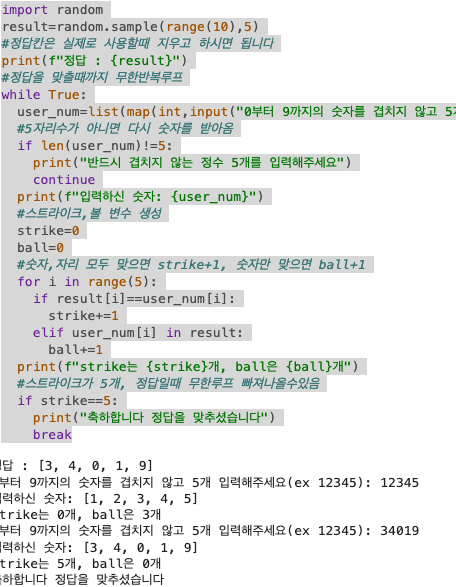

# AIFFEL Campus Online Code Peer Review Templete
- 코더 : 임성현
- 리뷰어 : 박의진

# # PRT(Peer Review Template)
- [X]  **1. 주어진 문제를 해결하는 완성된 코드가 제출되었나요?**
    - 네,  문제 해결 완성 코드가 제출 되었고, 루프 종료 조건(exit) 같은 확장 기능까지 구현되었습니다. '
       
    
- [X]  **2. 전체 코드에서 가장 핵심적이거나 가장 복잡하고 이해하기 어려운 부분에 작성된 
주석 또는 doc string을 보고 해당 코드가 잘 이해되었나요?**
    - 주석으로 3단계를 잘 정의하였습니다. (상대적으로 우리가 길게 여러단계로 진행했던 텍스트 전처리 단계를 간단하고 한번에 실행하는 함수를 활용함. 
    - isalnum()/isspace() 조건으로 필터링하는 문자 단위 컴프리헨션을 사용한 것은 제게 조금 어렵고 생소했으나 이런 방법이 있는 것이 굉장히 인상적이었습니다.
    - 축약과 컴프리헨션 위주의 코딩이 인상적임.
      
        
- [X]  **3. 에러가 난 부분을 디버깅하여 문제를 해결한 기록을 남겼거나
새로운 시도 또는 추가 실험을 수행해봤나요?**
    - 디버깅한 기록이나 추가 실험에 대한 기록은 남기지 않은 것으로 보입니다.
    - 코드 작업은 AI를 활용해서 최대한 간결하게 효율적으로 바꿀 수 있도록 수정 작업을 거쳐서 도출한 것이라고 했습니다.
    - **개선 아이디어**: 협업 및 리뷰 목적으로는 중간 출력이나 히스토리를 알 수 있게 주석처리 했으면 더 잘 이해할 수 있어 도움이 될 것입니다. 
    ---

        
- [X]  **4. 회고를 잘 작성했나요?**
    - 배운점 : 전체 과정을 아주 간결하게 구현하신 점이 인상적이었습니다. 
    - 'vocab.get(w, None)'을 사용해 OOV 단어도 에러 없이 처리한 점이 좋았습니다.  
    - 아쉬운점 : - 'with open(...)'을 사용해 데이터 연 다면 close()를 신경 쓰지 않아도 되어 좋습니다.
    - 중간에 'print()' 등으로 단어 분리, 각 단어별 빈도수 확인하는 단계가 없어 학습 시 디버깅이 다소 어려울 수 있습니다.
    - 느낀점 : 퀘스트 요건 별로 출력 확인 코드를 추가하며 리뷰어 입장에서 각 코드에 대한 기능 이해가 좀 더 수월할 듯 합니다. 단일 파일 외 함수 단위로 나눠도 좋을 듯합니다. 
    
        
- [X]  **5. 코드가 간결하고 효율적인가요?**
    - 전체 로직이 매우 짧고 간결합니다. 
      

# 회고(참고 링크 및 코드 개선)

